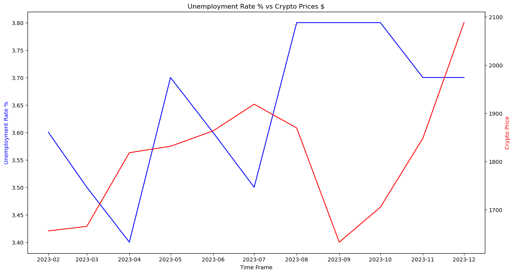
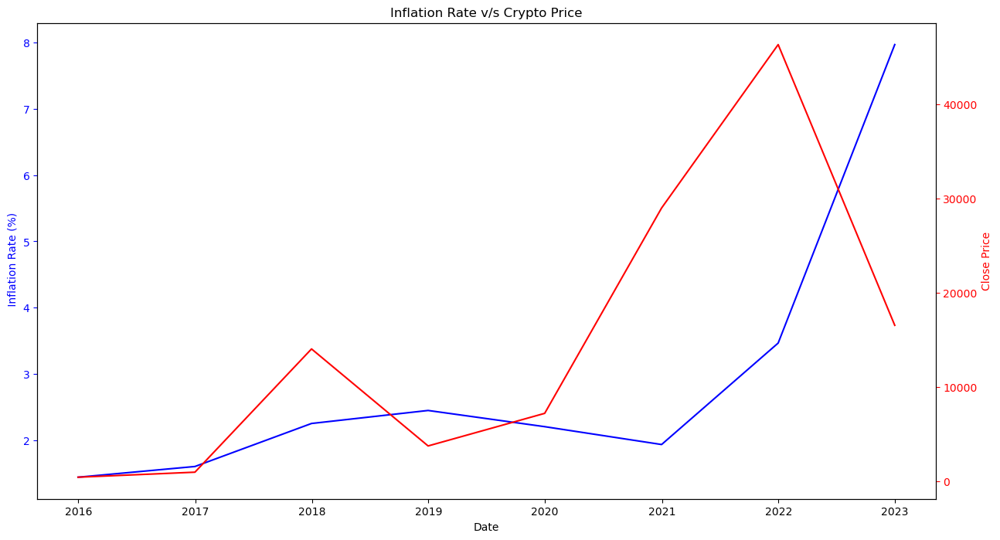
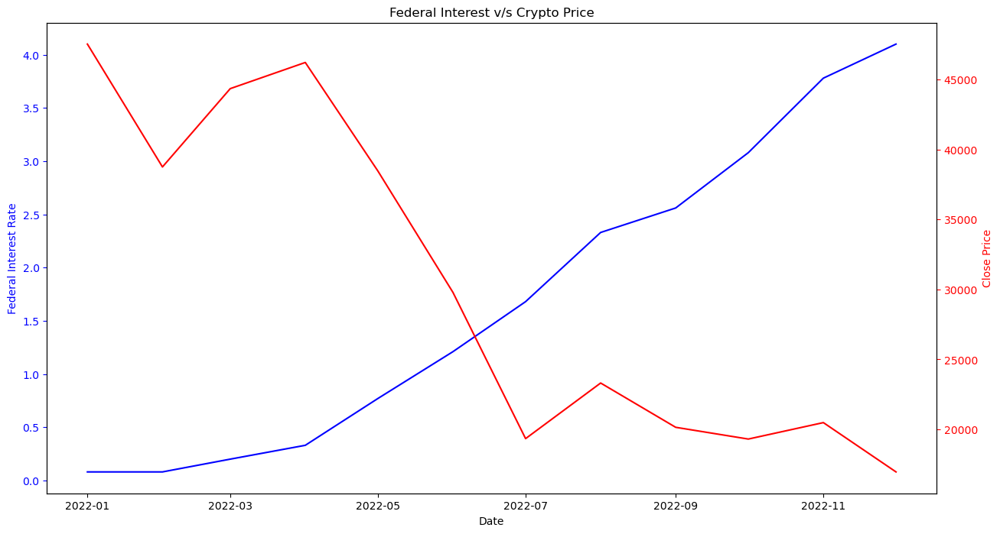
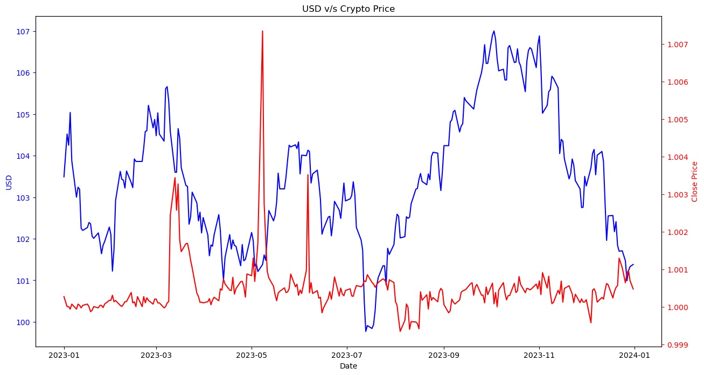

# IS 597PR Final Project Spring 2024
# Analyzing the factors that have influenced the price of Cryptocurrencies over the years

## Abstract -

The project aims to study the factors influencing the prices of Cryptocurrencies. 
Crypto prices are highly volatile because it is influenced by supply and demand, public sentiments and certain 
economic factors. The project aims to investigate these factors that drive the price of Cryptocurrencies.
Through this project, I hope to demonstrate how economic trends like Inflation, Federal Interest Rates and 
Unemployment rate; public opinion have affected Bitcoin’s value. I plan to analyze how tweets can have 
influence on Bitcoin’s price.

## Hypotheses -

*  Social Media opinions can positively or negatively impact the price of cryptocurrencies based on the sentiment.
*  Low Unemployment rates can lead to increase in Cryptocurrency prices, and vice versa
*  The Federal Interest rates have a strong influence over Cryptocurrency prices
*  Rise in inflation can cause the prices of Cryptocurrencies to decrease
*  Cryptocurrency prices can change depending on the trends of the US Dollar

## Analysis - 

## Twitter Sentiment -

While not a perfect correlation, there seem to be instances where positive sentiment aligns with price increases and negative sentiment coincides with price drops. This suggests that market sentiment, as captured by the indicators, can play a role in influencing short-term price movements.

## Unemployment

Although, there's no direct relation, we can see some trends in 2023. But the relationship is not consistent.

## Inflation Rates

Trends are quite evident after 2022, with most of the cryptocurrencies dipping low due to the rise in inflation rate around the world.Inflation is influenced by various economic factors such as supply chain disruptions, energy prices, monetary policy, and geopolitical events. These factors can also indirectly impact cryptocurrency prices.

## Federal Interest Rates

As evident from the plots, they do inhibit an inverse relationship, like in the year 2022, where there was a drastic increase in federal interest rates to combat inflation, which led to disruption in crypto market.

## US DOLLAR

In the year 2022, the graph displays a general inverse correlation between the value of the US Dollar (USD) and the crypto price. As the USD strengthens, the crypto price tends to decrease, and vice versa. This aligns with the concept of currency correlation, where a stronger USD can make cryptocurrencies appear less attractive, potentially leading to a decrease in demand and price.

## Conclusion
Not one single dominating factor. We cannot say with certainty that any one particular factor has a direct influence over cryptocurrencies. Maybe Federal Rates can play as an indicator whether crypto prices may go up or down. Cryptocurrencies being highly volatile are sensitive towards the market sentiment. People with strong influence can act as a catalyst to move the cryptocurrency market. Economic factors in combination can play a role in influencing the prices of cryptocurrencies.
Thus, invest wisely!

## References -

*  Twitter Datasets - https://www.researchsquare.com/article/rs-3192598/v1
                      https://data.mendeley.com/datasets/8fbdhh72gs/5
*  Crypto Datasets - https://coincodex.com/crypto/bitcoin/historical-data/
*  US Dollar - https://www.investing.com/indices/usdollar-historical-data
*  Federal Interest Rates - https://fred.stlouisfed.org/series/FEDFUNDS
*  Inflation Dataset - https://www.macrotrends.net/global-metrics/countries/WLD/world/inflation-rate-cpi
*  Unemployment Dataset - https://data-explorer.oecd.org/vis?lc=en&pg=0&fs[0]=Topic%2C1%7CEconomy%23ECO%23%7CShort-term%20economic%20statistics%23ECO_STS%23&fc=Topic&bp=true&snb=21&vw=tb&df[ds]=dsDisseminateFinalDMZ&df[id]=DSD_LFS%40DF_IALFS_INDIC&df[ag]=OECD.SDD.TPS&df[vs]=1.0&pd=%2C&dq=USA.UNE_LF_M...Y._T.Y_GE15..M&ly[cl]=TIME_PERIOD&to[TIME_PERIOD]=false&lo=13&lom=LASTNPERIODS
*  Gemini - https://gemini.google.com/