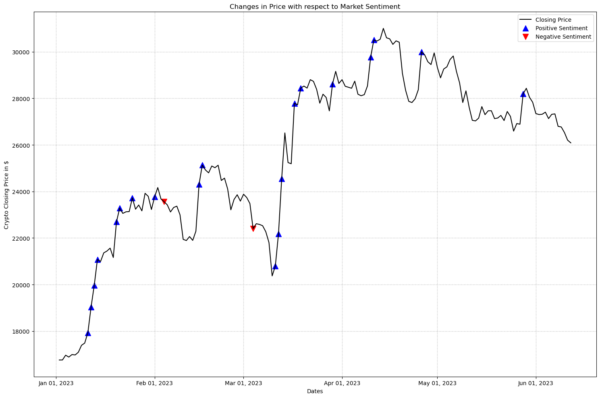

# IS 597PR Final Project Spring 2024
# Analyzing the factors that have influenced the price of Cryptocurrencies over the years

## Abstract -

The project aims to study the factors influencing the prices of Cryptocurrencies. 
Crypto prices are highly volatile because it is influenced by supply and demand, public sentiments and certain 
economic factors. The project aims to investigate these factors that drive the price of Cryptocurrencies.
Through this project, I hope to demonstrate how economic trends like Inflation, Federal Interest Rates and 
Unemployment rate; public opinion have affected Bitcoin’s value. I plan to analyze how tweets can have 
influence on Bitcoin’s price.

## Hypotheses -

*  Social Media opinions can positively or negatively impact the price of cryptocurrencies based on the sentiment.
*  Low Unemployment rates can lead to increase in Cryptocurrency prices, and vice versa
*  The Federal Interest rates have a strong influence over Cryptocurrency prices
*  Rise in inflation can cause the prices of Cryptocurrencies to decrease
*  Cryptocurrency prices can change depending on the trends of the US Dollar

## Analysis - 

# Twitter Sentiment -

While not a perfect correlation, there seem to be instances where positive sentiment aligns with price increases and negative sentiment coincides with price drops. This suggests that market sentiment, as captured by the indicators, can play a role in influencing short-term price movements.

## References -

*  Twitter Datasets - https://www.researchsquare.com/article/rs-3192598/v1
                      https://data.mendeley.com/datasets/8fbdhh72gs/5
*  Crypto Datasets - https://coincodex.com/crypto/bitcoin/historical-data/
*  US Dollar - https://www.investing.com/indices/usdollar-historical-data
*  Federal Interest Rates - https://fred.stlouisfed.org/series/FEDFUNDS
*  Inflation Dataset - https://www.macrotrends.net/global-metrics/countries/WLD/world/inflation-rate-cpi
*  Unemployment Dataset - https://data-explorer.oecd.org/vis?lc=en&pg=0&fs[0]=Topic%2C1%7CEconomy%23ECO%23%7CShort-term%20economic%20statistics%23ECO_STS%23&fc=Topic&bp=true&snb=21&vw=tb&df[ds]=dsDisseminateFinalDMZ&df[id]=DSD_LFS%40DF_IALFS_INDIC&df[ag]=OECD.SDD.TPS&df[vs]=1.0&pd=%2C&dq=USA.UNE_LF_M...Y._T.Y_GE15..M&ly[cl]=TIME_PERIOD&to[TIME_PERIOD]=false&lo=13&lom=LASTNPERIODS
*  Gemini - https://gemini.google.com/